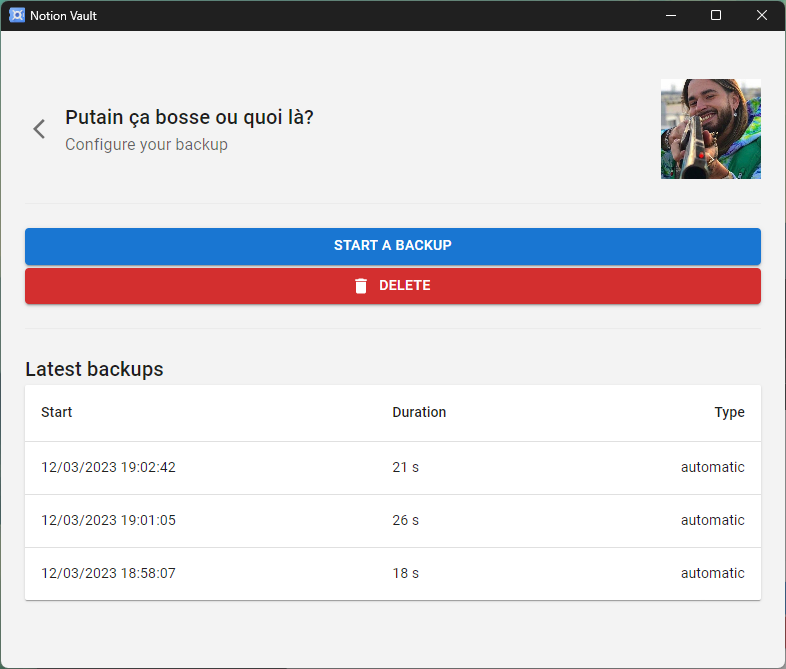

# Notion Vault

Notion Vault is an open-source application that allows you to create automatic and manual backups of your workspaces on Notion.so. The application is easy to use and connects to your Notion account using OAuth, ensuring the security of your data.

## Features

- Automatic and manual backups of your Notion workspaces
- Easy to connect with Notion using OAuth
- Simple and user-friendly interface
- Available for Windows, macOS, and Linux

## Installation
You can download Notion Vault for Windows, macOS, and Linux from the [releases](https://github.com/Theo-Farnole/notion-vault/releases) page. Follow the installation instructions for your operating system to get started.

## Usage
To use Notion Vault, you need to connect it to your Notion account using OAuth. Once connected, you can choose which workspaces you want to back up and how often you want to create backups.

You can create manual backups at any time by clicking the "Create Backup" button on the dashboard. Automatic backups will be created according to your settings.

## Main tasks before release
- Publish build into "release"
- Advertise to notion communities
 
## Contributing
Notion Vault is an open-source project and we welcome contributions from anyone. To contribute, please fork the repository and submit a pull request with your changes.

## Issues
If you encounter any issues with Notion Vault, please open an issue on the GitHub repository. We will do our best to address any issues in a timely manner.

## Credits 
Icon by [Freepik](https://www.flaticon.com/free-icons/vault)  
Original template Electron+React from [this repo](https://github.com/yhirose/react-typescript-electron-sample-with-create-react-app-and-electron-builder)  
Article: exporting notion data with a OAuth token https://notionbackups.com/blog/automated-notion-backup-api
